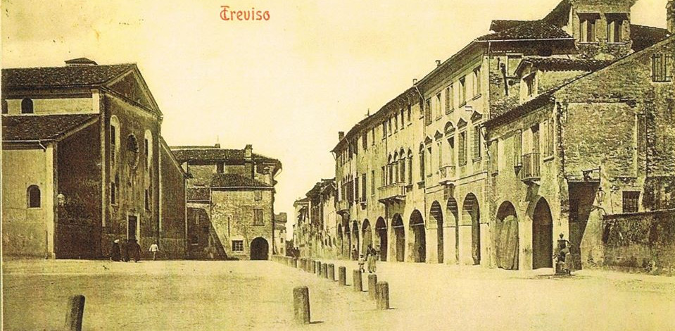
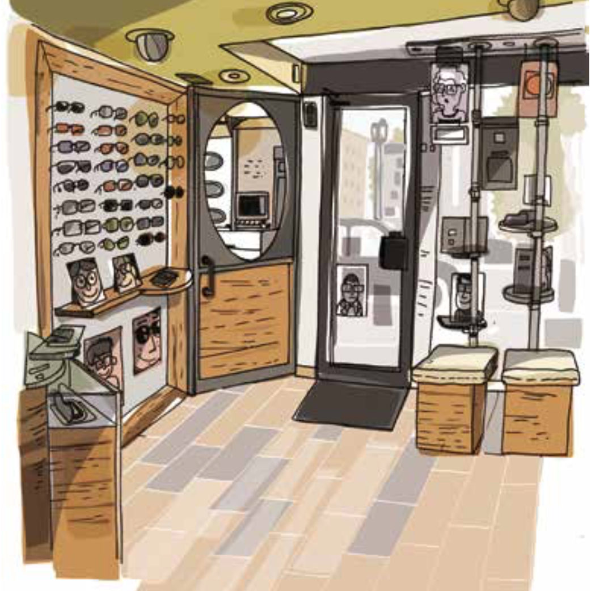

L'Ottica Molinari nasce alla fine degli anni 70, dalla volontà di Paolo Molinari di applicare concretamente quanto appreso nel suo percorso formativo. Il negozio, oggi completamente rinnovato, si trova in Piazza della Vittoria 11, nel cuore di Treviso. Conosciuto ed apprezzato dalla cittadinanza, è da decenni punto di riferimento per la qualità dei prodotti offerti e le griffe che si possono trovare sia per gli occhiali da vista sia per le collezioni da sole.

## Paolo Molinari

La mia cultura professionale deriva dall'ottica classica e, attraverso un continuo percorso d'aggiornamento e voglia di apprendere, ha scalato i gradini di questa meravigliosa scienza che è l'Optometria.

Il miglioramento delle mie competenze optometriche è iniziato dopo l'incontro con il Dott. Vittorio Roncagli, che mi ha aiutato a trovare la mia strada...l'entusiasmo e le motivazioni per affrontare tutto ciò che la vita presenta e poter avere le soddisfazioni nell'applicare giornalmente ciò in cui si crede.

Le competenze apprese e la capacità di integrare le mie conoscenze con le esigenze diagnostiche di medici professionisti sono state la naturale conseguenza non di un lavoro qualsiasi, ma una nuova fonte di energia inesauribile, una carica interiore per capire, studiare e crescere nella mia professionalità.

## L'unicità di un sogno

> Un intreccio di tradizione familiare, innovazione, volontà di spingersi oltre e l’amore hanno portato alla nascita di uno dei più prestigiosi negozi del centro di Treviso: l’Ottica Molinari.
>
> -- <cite>Giulia Zandonadi</cite>

[Leggi l'articolo](/downloads/Ottical-Molinari_L-unicita-di-un-sogno.pdf)

**Referenze**

- [Curriculum Vitae](/downloads/Paolo_Molinari_Curriculum_Vitae.pdf)
- [Master Tesi - Valutazione e rieducazione delle disfunzioni visuo-posturali](/downloads/Tesi_Paolo_Master_Roma_La_Sapienza.pdf)
