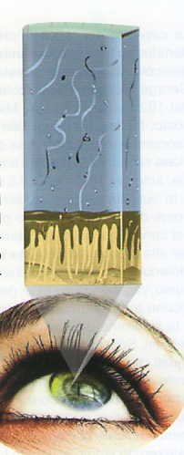
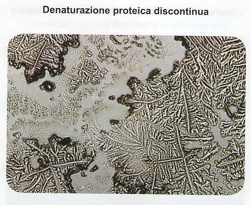

## Che cos'è "l'occhio secco" e quali sono i suoi sintomi

Irritazione, bruciore, prurito agli occhi, possono costituire i sintomi di un problema chiamato "occhio secco".

L'occhio secco è un disturbo molto diffuso e spesso sottovalutato. E' determinato da un'alterazione del film lacrimale, in conseguenza di una sua scarsa produzione o eccessiva evaporazione. In entrambi i casi si riducono le funzioni svolte da questo importante fluido fisiologico.

Tale ridotta funzionalità produce diverse conseguenze negative. A breve termine, può causare fastidi e disagi. A lungo termine, espone l'occhio al rischio di continue infiammazioni e infezioni nonchè traumi della superfice dell'occhio. Infatti il film lacrimale è essenziale per la protezione, il nutrimento e l'efficienza dei nostri occhi e la sua alterazione va adeguatamente affrontata.

## Che importanza riveste il film lacrimale

Il film lacrimale è composto da 3 strati, ciascuno dei quali riveste una funzione importante per mantenere l'occhio sano e la vista nitida.

Lo strato più interno mucoso, aderisce alla superficie dell'occhio trattenendo l'acqua e favorendo una ottimale e uniforme distribuzione del film lacrimale su tutta la superficie esposta all'aria.
Lo strato intermedio acquoso è composto da acqua e ioni essenziali che nutrono e mantengono le giuste idratazioni della superficie dell'occhio.
Lo strato più esterno lipidico, svolge la funzione di trattenere l'umidità degli strati sottostanti, come un coperchio, evitandone l'evaporazione e rendendo la superficie dell'occhio uniforme per una visione più nitida.
Ogni singolo strato svolge una sua specifica funzione. Quindi, la riduzione o alterazione anche di solo uno dei 3 strati può causare uno squilibrio del film lacrimale.

## Quali sono le cause principali

Le cause sono di varia natura ma generalmente si possono suddividere in 2 categorie:

- <abbr title="L'utilizzo prolungato del computer, permanenza in ambienti chiusi con aria climatizzata, sport che espongono gli occhi a cloro, acqua salata, sole, vento e smog, uso di farmaci, colliri decongestionanti o con conservanti, bevande ad alto contenuto di alccol o caffeina, utlizzo di lenti a contatto.">Fattori comportamentali</abbr> che dipendono dallo stile di vita  e che determinano sintomi occasionali.
- <abbr title="Variazioni ormonali (peri-menopausa, menopausa), utilizzo di farmaci (per il controllo della presione, diuretici ecc.), malattie associate come il diabete, artrite reumatiche, Sindrome di Sjogren (malattaia infiammatoria cronica autoimmune che distrugge le ghiandole lacrimali), interventi chirurgici all'occhio (cataratta e refrattiva).">Fattori di predisposizione</abbr> che determinano un maggior rischio di sviluppare una forma cronica.

La valutazione qualitativa della lacrima è un test basato sull'osservazione della felcizzazione della lacrima e ci indica se ci sono alterazioni della struttura del film lacrimale, sia in quantità che qualità.

E' un valido aiuto a tutte quelle persone che hanno problemi di DISLACRIMIA, che portino o non portino lenti a contatto.

<Message>

Il test si esegue su appuntamento presso il nostro studio.

<Contacts />

</Message>