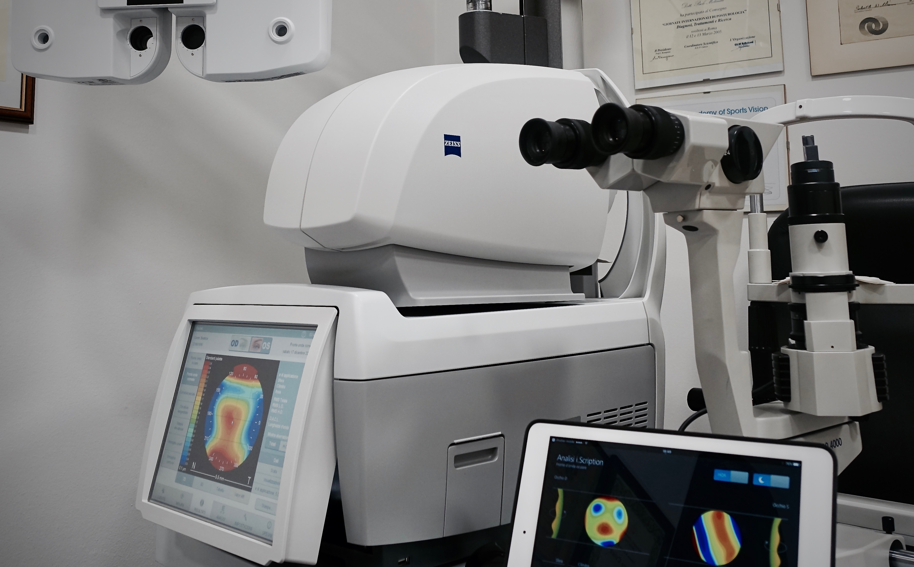
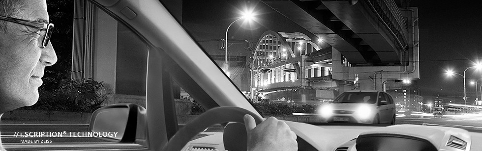
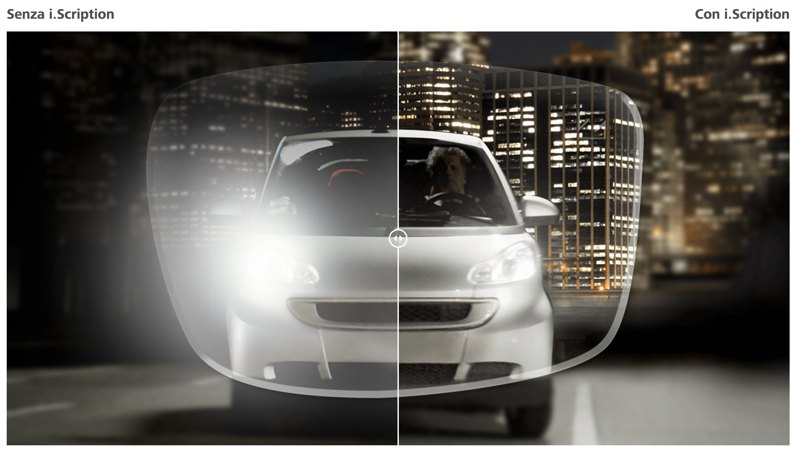
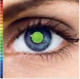
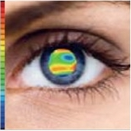
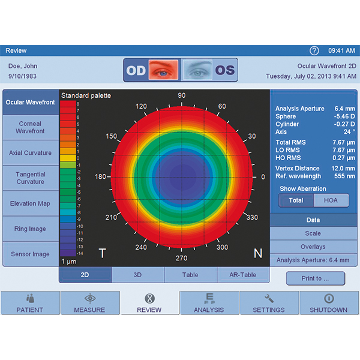
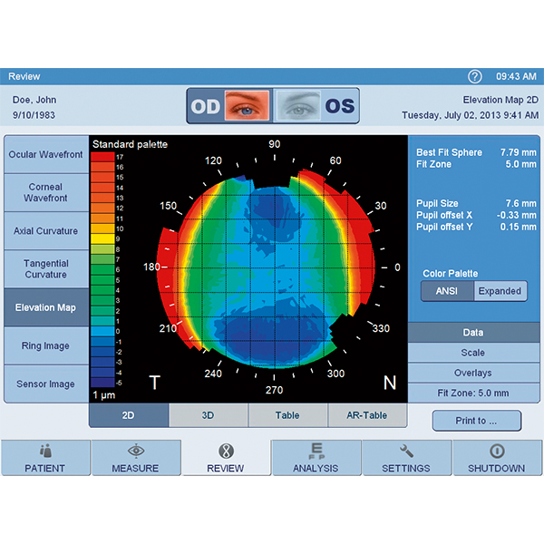

## Alta tecnologia per una visione nitida e performante per ogni singolo occhio

I nuovi processi di produzione ad alta tecnologia hanno rivoluzionato lo standard qualitativo delle lenti, migliorandolo. Carl Zeiss Vision ha introdotto sul mercato uno strumento di analisi ad alta precisione i.Profiler® unico nel suo genere, che determina la mappa ottica dell'occhio e consente di tenere in considerazione i dati risultanti dall'analisi per la costruzione della lente e la definizione dei suoi poteri correttivi. Le lenti così costruite vengono chiamate lenti i.Scription®

## Motivazione

Più di 700 anni fa, l'uomo scoprì un modo per migliorare la vista avvalendosi di un supporto visivo. L'occhiale, come è conosciuto oggi, fu sviluppato intorno al 1850. Da allora moltissimo è cambiato. L'ultima pietra miliare è rappresentata dall'introduzione di una tecnologia che permette di utilizzare i dati dell'analisi visiva in effettivi dati di calcolo e produzione delle lenti.

Perché questa scoperta è così importante? La risposta è semplice: perché nessun occhio è uguale ad un altro. Ogni occhio è unico come lo sono le impronte digitali.

## Come funziona

Lo strumento di analisi i.Profiler® di Carl Zeiss Vision rende possibile analizzare l'occhio come non si è mai fatto prima, e soprattutto di tenere conto di queste informazioni per i successivi processi produttivi. Lo strumento opera sulla base della cosiddetta tecnologia del fronte d'onda. Oltre ai metodi di analisi tradizionali, utilizzati dal Medico Oculista, assolutamente validi, ma incentrati sulla misurazione della capacità visiva solo in condizione di luce diurna e ad alto contrasto, questo sistema tiene in considerazione anche le performance visive al cambio delle condizioni di luce, dei riflessi, dei colori e del cambiamento di contrasto. Non esiste analisi più precisa e completa (l'analisi con i.Profiler® deve sempre essere accompagnata con la tradizionale refrazione soggettiva):

- Acuità visiva
- Visione spaziale
- Interazione degli occhi

Da queste analisi nasce la soluzione ottica ottimizzata e individualizzata con tecnologia i.Scription®.

## Le lenti i.Scription® migliorano le performance visive

Tutti questi parametri sono tenuti in considerazione nel calcolo dei valori della lente. Questo ha un enorme vantaggio: la prestazione dell'occhio può essere analizzata al centesimo di diottria. Questo si traduce in una migliore acuità visiva, superiore anche di 25 volte rispetto a quella possibile con una tecnologia tradizionale. Anche i deficit visivi che fino ad adesso non potevano essere corretti adeguatamente, ora sono parte del calcolo della lente personalizzata. Il risultato è una visione più nitida, con contrasti più netti e colori più brillanti. Com'è possibile tutto questo? Ecco un esempio:

Molte persone che indossano occhiali hanno performance visive soddisfacenti durante il giorno. Appena cala la notte, però, l’acuità visiva diminuisce. Spesso le luci artificiali intense e diffuse irritano molto gli occhi. Guidare la macchina diventa un rischio maggiore in fatto di sicurezza. La causa potrebbe essere determinata proprio dall’uso di lenti che non sono ottimizzate per queste condizioni. Prima d’ora i controlli dell’efficienza visiva non permettevano di andare oltre e determinare tutti i deficit visivi. Questa indagine tradizionale viene chiamata “refrazione soggettiva” (si chiede la lettura di lettere e numeri su di uno schermo). Questa analisi si basa molto sulla collaborazione del cliente e sull’esattezza delle sue percezioni, ma sono facilmente comprensibili i limiti di questa analisi.

## L'importanza della visione notturna

i.Profiler® analizza ogni singolo occhio, creando anche la dilatazione delle pupille, condizione questa che si verifica di notte. Inoltre, è il primo sistema che rileva le cosiddette aberrazioni di alto ordine. Le aberrazioni portano i raggi di luce a essere riflessi più intensamente sui bordi esterni della lente rispetto al centro, con il risultato di una ridotta percezione del contrasto. Altra aberrazione è data dall’asimmetria, che compare quando i raggi di luce sono riflessi in maniera tale che una persona vede qualcosa che alle estremità ricorda la coda di un animale. Entrambi i fenomeni sono responsabili di una cattiva visione al crepuscolo o di notte.

I risultati di misurazione sono alla base dell’ottimizzazione della lente i.Scription®. Questa ottimizzazione è un’opzione offerta da Carl Zeiss Vision per le lenti ZEISS. L’ottimizzazione i.Scription® è possibile grazie a:

- Refrazione oggettiva con i.Profiler®
- Refrazione soggettiva
- Calcolo dei valori della lente, effettuato nei laboratori Carl Zeiss Vision, attraverso algoritmi matematici
- Processi di produzione ad altissima precisione

I clienti che già indossano le lenti i.Scription® ne hanno da subito apprezzato i benefici. La visione notturna è enormemente migliorata e chi guida si sente più sicuro. I colori sono percepiti molto più intensamente, tutte le immagini sono molto più nitide e i contrasti sono sorprendenti.

### Referenze
- [Lenti di precisione ZEISS con tecnologia i.Scription®](https://www.zeiss.it/vision-care/it_it/zeiss-products/lenti-con-tecnologia-i-scription.html)

_Fonte immagini: https://www.zeiss.it_
